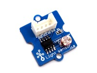
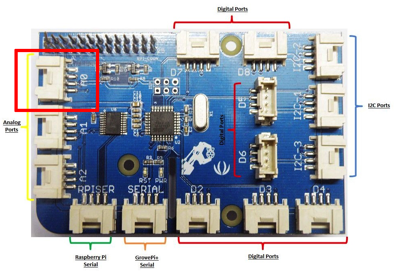
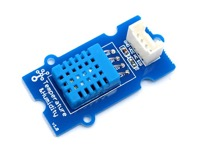
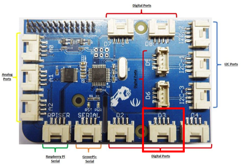

# hackathonwrapper
## IoTCS wrapper for Integration Hackathon in Madrid

The purpose of this piece of code is to send real-time data from GrovePi sensors to Oracle Internet of Things Cloud Service, solving the _hardware_ part of the IoT part.

Before powering on the Raspberry Pi, it is important to connect each sensor to the right GrovePi board port:

The Light sensor

   

is to be connected to the Analog Port #0.

   

And the DHT sensor

   

is to be connected to the Digital Port #3.

   

You might use other analog and digital ports, but then you'll need to change the [grovepi_iotcs.js](grovepi_iotcs.js) file accordingly.

Once done, participants only need to power the given Raspberry Pi and, if everything runs as expected, sensor data will be automatically sent to the Hackathon's IoTCS instance's device(s).

Each RPi is already setup for a specific partner. Thus, will send sensor data to the partner's virtual device in IoTCS. Make sure you get your right RPi! :wink:

Once Hackathon is over, each partner will be able to take the whole kit with him. Take into account that the RPi is setup to connect to Hackathon's WIFI network, which, obviously, won't be available at partner's premises.

To re-configure the network, follow these steps:

1. With the RPi powered off, take the microSD out and place it in a laptop or computer, using a SD adapter.
2. The card should have been mounted as a new Drive named `boot`.
3. In there, you'll see a file named `wpa_supplicant.conf.SAMPLE`. Copy it as `wpa_supplicant.conf` in the same folder.
4. Edit it and replace the `ssid` and `psk` values to your local WIFI network.
5. Place the microSD card back to the RPi and power it on.

You will need to check in your WIFI router the IP address assigned to the RPi. As a tip, all RPi's MAC addresses start with `b8`.

Finally, the credentials for the RPi are `pi / pi`. From the `pi` user you can sudo any `root` command.

## Happy Hackathon-ing!!!

### Further reading

[Richer sample of GrovePi and IoTCS](https://github.com/ccasares/grovepi-iotcs)
